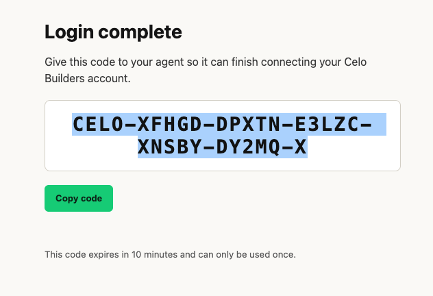

# AnyPay — Build Spec & Handoff

> Single source of truth for building AnyPay. Everything here was validated on-chain
> or tested end-to-end on **2026-07-14**. A fresh coding session should read this file
> first, then go straight to the build plan at the bottom. Deadline: **2026-08-03 09:00 GMT**.

---

## 1. What we're building

**AnyPay — multi-currency settlement for x402 on Celo.**
Agents pay in USDC. Merchants get paid in their local Mento stablecoin. One HTTP request in between.

Celo's x402 facilitator settles in **USDC only**. Celo's differentiator is Mento's local
stablecoins (KESm, COPm, PHPm…). AnyPay is the missing FX leg that connects the two: an
**independent companion agent** for the facilitator — no fork, no facilitator changes, no
contracts to deploy in v1. It plugs in from the outside as a registered `payTo` recipient.

### Two surfaces

**Merchant side (core).** Merchant registers once:
```
POST /register  { "payTo": "0xabc...", "currency": "KESm" }
```
Gets back an AnyPay collection address to use as the `payTo` in their 402 responses. The
facilitator settles buyer USDC there as usual; AnyPay swaps it via the Mento router and
forwards the local stablecoin to the merchant, returning the tx hash as receipt.

**Agent side (bonus).** Same core, reversed, x402-gated:
```
POST /pay  { "amount": "5", "currency": "KESm", "to": "0x..." }
```
Any agent can send a local-stablecoin payout in one request.

---

## 2. Architecture decision (IMPORTANT — decided 2026-07-14)

**Hybrid: deterministic money-path + eve as the agent layer. The LLM never touches funds.**

The core (settlement → swap → forward) is a **deterministic pipeline in plain code + viem**.
No LLM in the money path — an LLM there only adds nondeterminism, latency, per-tx cost, and a
new failure mode. Payment rails must be boring and auditable.

eve is justified for the *project* (the hackathon rewards agentic framing; eve is Vercel's
agent framework; the `/pay` natural-language surface is a genuine agent use case)
**but only as a wrapper around deterministic tools**, not as a reasoner over money.

- `swapAndForward` = a plain function / eve tool. Fires the router. Deterministic. Idempotent-safe.
- eve's LLM only sits at the front door of `/pay` (natural-language agent-to-agent interface).
- Merchant settlement path can be a webhook/cron — no LLM at all.

**Plan B:** if eve setup eats livestream time, drop it and ship plain Vercel API routes + viem
+ KV. The winning metrics (Track 1 volume, Track 2 count) don't depend on the framework, so
this is a safe fallback.

---

## 3. Verified on-chain facts (Celo mainnet, 2026-07-14)

**Do NOT use the Mento SDK — call the router directly with viem (see §4).**

### Contracts
| Name | Address |
|---|---|
| Mento Router (v3) | `0x4861840C2EfB2b98312B0aE34d86fD73E8f9B6f6` |
| Factory: USDC ↔ USDm (FPMM) | `0xa849b475FE5a4B5C9C3280152c7a1945b907613b` |
| Factory: USDm ↔ local (Virtual) | `0x22abd4ADF6aab38aC1022352d496A07Acee5aCB3` |

### Tokens
| Symbol | Address | Decimals |
|---|---|---|
| USDC | `0xcebA9300f2b948710d2653dD7B07f33A8B32118C` | 6 |
| USDm (bridge hop) | `0x765DE816845861e75A25fCA122bb6898B8B1282a` | 18 |
| KESm | `0x456a3D042C0DbD3db53D5489e98dFb038553B0d0` | 18 |
| COPm | `0x8A567e2aE79CA692Bd748aB832081C45de4041eA` | 18 |
| PHPm | `0x105d4A9306D2E55a71d2Eb95B81553AE1dC20d7B` | 18 |

### Route (all launch currencies)
Two hops: `USDC → USDm` (FPMM factory), then `USDm → local` (Virtual factory).

### Liquidity — verified, safe at our scale
- All three pairs `isPairTradable: true`, circuit breaker OK.
- **Zero slippage** from 10 → 5,000 USDC: the local pools are Virtual (mint/burn against the
  Mento reserve at oracle price), not x·y=k. There is no pool inventory to drain. ~0.05% fee.
- Only real bound is the USDC↔USDm FPMM (~$30k/side inventory, ~500k USDm hourly trading
  limit) — 4-5 orders of magnitude above micropayment size. Irrelevant for us.
- Sample rates observed: 1 USDC ≈ 127.9 KESm, ≈ 3,251 COPm, ≈ 61.3 PHPm.
- Adding GHSm / NGNm / XOFm later = one config entry (same route shape, all tradable).

### Rebrand note
Mento renamed the tokens: old `cKES / cCOP` → new **`KESm / COPm / PHPm`**. Use the new names.

---

## 4. eve gotchas (all hit and solved 2026-07-14)

A throwaway eve agent was scaffolded, given two tools (Celo balance + Mento FX quote), and
**deployed successfully to Vercel production** (`eve-test-anypay.vercel.app`). It answered
correctly using both tools, local and in prod. These are the traps — all resolved:

1. **eve needs Node ≥ 24** (current is 0.24.1). System Node was v20. Installed a standalone
   Node 24 at `~/.local/node24`. Prefix commands with:
   ```bash
   export PATH=$HOME/.local/node24/bin:$PATH
   ```

2. **The Mento SDK (`@mento-protocol/mento-sdk`) is UNUSABLE inside eve.**
   - Its ESM build has extensionless relative imports → crashes the eve dev server (Node ESM).
   - The `createRequire`/CJS workaround loads locally but **crashes the deployed function**
     (`FUNCTION_INVOCATION_FAILED`) because eve's bundler doesn't ship `node_modules`.
   - **Solution:** skip the SDK. Call the router directly with viem. Routes are fixed
     constants (see §3). ABI:
     ```
     struct Hop { address from; address to; address factory; }
     function getAmountsOut(uint256 amountIn, Hop[] path) view returns (uint256[])
     function swapExactTokensForTokens(uint256 amountIn, uint256 amountOutMin,
                                       Route[] routes, address to, uint256 deadline)
     ```
   - **Bonus:** `swapExactTokensForTokens` takes a `to` — so **swap + forward to the merchant
     is ONE transaction**. No separate transfer needed.

3. **Two eve tools statically importing the same package breaks eve's bundler**
   (`Expected one bundled authored module`). Keep a shared dependency in ONE tool, or use raw
   `fetch` for the simple stuff. (The balance tool was rewritten to raw JSON-RPC `fetch`.)

4. **`eve link` is interactive-only** and without it the agent has no AI Gateway credentials
   (`GatewayAuthenticationError` 401). Non-interactive path:
   ```bash
   vercel link --project <name> --yes
   vercel env pull .env.local          # pulls VERCEL_OIDC_TOKEN
   ```
   Deploy with `npm exec -- eve deploy`. Production API auth = `Authorization: Bearer $VERCEL_OIDC_TOKEN`.

5. eve project layout: `agent/instructions.md` (system prompt), `agent/agent.ts` (model),
   `agent/tools/*.ts` (filename = tool name, `defineTool` + Zod `inputSchema`),
   `agent/channels/eve.ts` (auth). Default model `anthropic/claude-sonnet-5`.
   Dev: `npm exec -- eve dev --no-ui` → `http://127.0.0.1:2000/`. Session API:
   `POST /eve/v1/session` then `GET /eve/v1/session/:id/stream`.

---

## 5. Hackathon integration

- **Hackathon:** Agentic Payments & DeFAI — celobuilders.xyz, slug `agentic-payments-defai`.
- **Tracks entered:** `most-revenue-generated` (Track 1) + `most-x402-payments` (Track 2).
- **Attribution tag: `celo_a1d871ce7f3a`** — locked to repo `artugrande/anypay-celo`.

### Registration flow (how the tag is obtained)
Install the Celo Builders skill → connect via Google (one-time browser sign-in; the browser
shows a short claim code you hand back to the agent — see below) → save a draft submission →
the tag is returned instantly, derived from and locked to the GitHub repo slug.



*The connection step: after Google sign-in, the browser returns a one-time claim code that the
agent uses to finish connecting the account. (The code shown is already spent.)*

### Track 1 — tagging (required, one line)
Every on-chain tx AnyPay sends (the swaps) must append the tag via `@celo/attribution-tags`:
```ts
import { toDataSuffix } from "@celo/attribution-tags";
// append to the router calldata:
const data = encodedSwapCalldata + toDataSuffix("celo_a1d871ce7f3a").slice(2);
```
Only the assigned tag is credited. If bringing your own code too:
`toDataSuffix(["yourCode", "celo_a1d871ce7f3a"])`. Window: Celo mainnet, Jul 1 – Aug 3 09:00 GMT.
**⚠️ Not yet tested live** — pending wallet funding (see §6). This is the one execution path
still to verify: a real USDC→KESm swap from the agent wallet with the tag appended.

### Track 2 — x402 (no tagging)
Route settlements through the Celo x402 facilitator (`x402.celo.org`). Every settlement
to/from the declared agent wallet is counted automatically, retroactive to Jul 1. Facilitator
already tested by Arturo. Leaderboard: https://dune.com/celo/agentic-payments-defai-hackathon

---

## 6. Assets & credentials

| Item | Value / location |
|---|---|
| Public repo | https://github.com/artugrande/anypay-celo (`~/Desktop/anypay-celo`) |
| Attribution tag | `celo_a1d871ce7f3a` |
| Agent wallet (public) | `0xfAcfE00760561fAB2DB764C6a4b2016B38d0e732` |
| Agent wallet key | `~/.anypay-wallet.env` (chmod 600, NOT in repo) |
| celobuilders API key + IDs | `~/.anypay-celobuilders.env` (chmod 600, NOT in repo) |
| Test eve deployment | `eve-test-anypay.vercel.app` (throwaway) |

**⚠️ Wallet needs funding before the first real swap:** ~0.5 CELO (gas) + ~5 USDC (Celo
mainnet) to `0xfAcfE00760561fAB2DB764C6a4b2016B38d0e732`.

---

## 7. Status

**Done (2026-07-14 → 07-15):**
- ✅ Product concept validated.
- ✅ Registered on celobuilders, draft saved, **attribution tag obtained** (NOT published yet).
- ✅ Public repo created with README.
- ✅ Mento liquidity verified on-chain for KESm/COPm/PHPm.
- ✅ Agent wallet generated and funded (5 CELO + 5 USDC).
- ✅ **AnyPay agent built and deployed** to `https://anypay-celo.vercel.app`:
  `quote_fx` + `pay` tools over a deterministic `swapAndForward` lib (direct Mento router via
  viem, attribution tag appended to calldata). LLM drives the tools; LLM never touches funds.
- ✅ **Verified live on mainnet** — real tagged swap+forward delivered:
  - KESm: [`0x1287…2790`](https://celoscan.io/tx/0x12877974982f4e7d9040f30c26d9aacdf2b3bab64895c6dfde3b855001ee2790) (recipient received 63.97 KESm)
  - COPm: [`0x0643…0c53`](https://celoscan.io/tx/0x0643925b47be745e3fa493d30e9cb2614368cc1a782d1934eea8df3040320c53) (recipient received 1,622.47 COPm)
  - Both confirmed via `verifyTx` → `codes: ["celo_a1d871ce7f3a"]`.

**Pending:**
- ⬜ Merchant side: `/register` + settlement sweep (core §1) — not built yet; `/pay` (agent
  side) is done. Same `swapAndForward` powers both; add a KV `{payTo → currency}` map + a sweep
  that runs `swapAndForward(currency, settledUsdc, merchantPayTo)`. No LLM in that path.
- ⬜ For submission by Aug 3: X registration post (`socialLink`), ERC-8004 agent ID
  (`erc8004Url`), agent wallet address field, demo URL — then publish the celobuilders draft.
- ⬜ Route x402 settlements through the facilitator to the agent wallet (Track 2 counting).

---

## 8. Build plan for tomorrow (~1 hour)

Start a Celo session in `~/Desktop/anypay-celo`. Node: `export PATH=$HOME/.local/node24/bin:$PATH`.

1. **Scaffold eve** into the repo (`npx eve@latest init` — Node 24). `vercel link` + `vercel env pull`.
2. **`swapAndForward` tool** (deterministic, viem, direct router call from §3/§4):
   quote via `getAmountsOut`, apply slippage floor, `approve` USDC to router if needed,
   `swapExactTokensForTokens(amountIn, minOut, routes, to=recipient, deadline)` with the
   attribution-tag suffix appended to calldata. Load the agent key from env.
3. **`/pay` (bonus, agent surface):** expose `swapAndForward` as an eve tool so the LLM can
   call it from natural language. x402-gate this endpoint.
4. **`/register` + merchant settlement (core):** KV map `{payTo → currency}`; a collection
   address per merchant (v1: shared hosted wallet); on settlement, run `swapAndForward` with
   `to = merchant payTo`. Poll via eve schedule or webhook. **No LLM in this path.**
5. **Verify:** fund wallet, run one real KESm swap, confirm the tag with `verifyTx` from
   `@celo/attribution-tags`, check it lands on the Dune leaderboard.
6. **Deploy** (`eve deploy`) and demo with `curl`.

Honest v1 limitation to state openly: AnyPay briefly holds funds between settlement and
forward (hosted wallet, small amounts, open source). v2 = a router contract doing
receive→swap→forward atomically, restoring the facilitator's non-custodial property.
